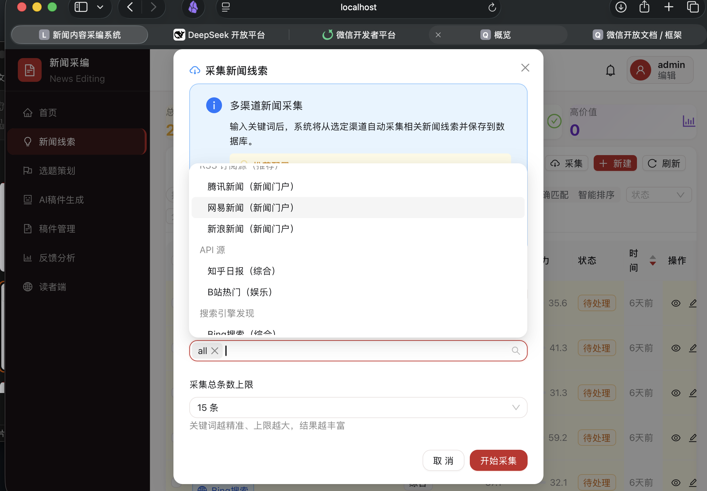
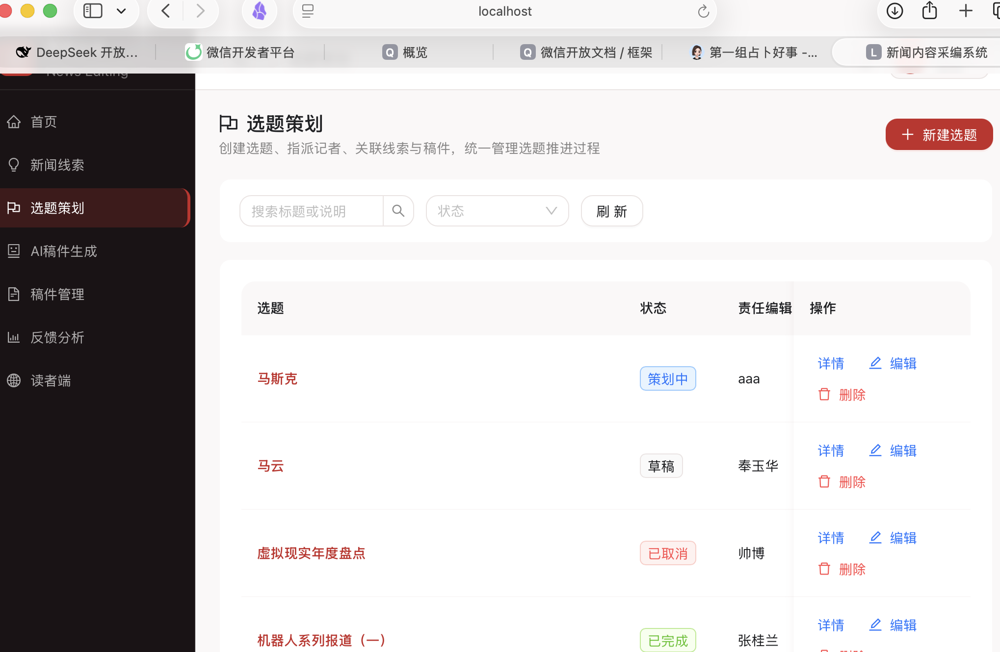
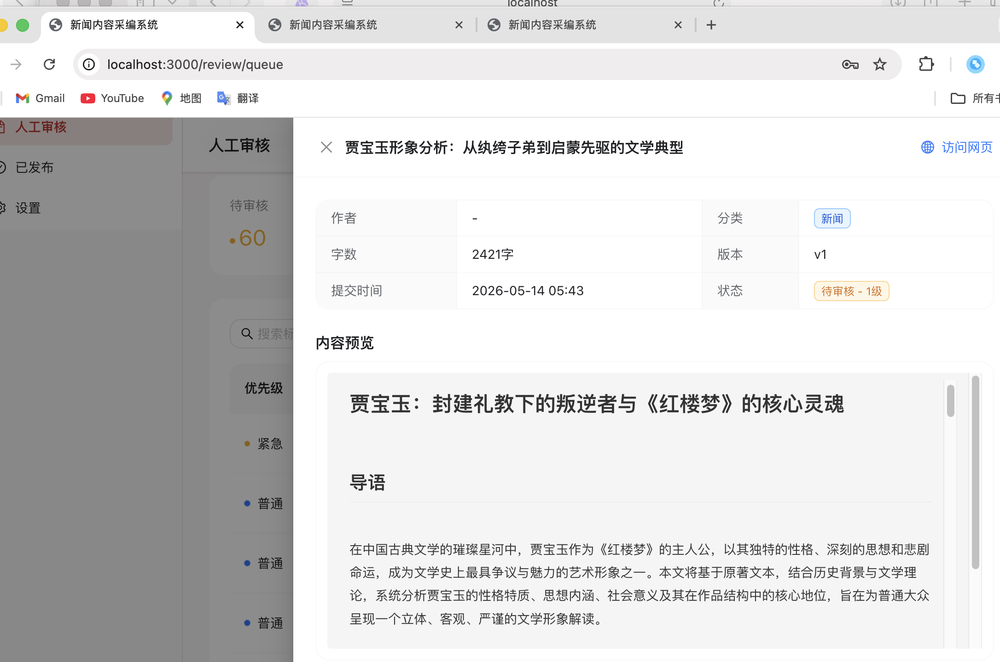
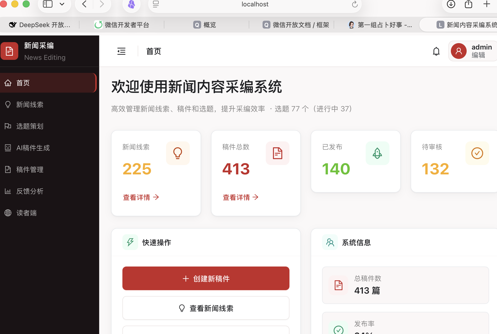
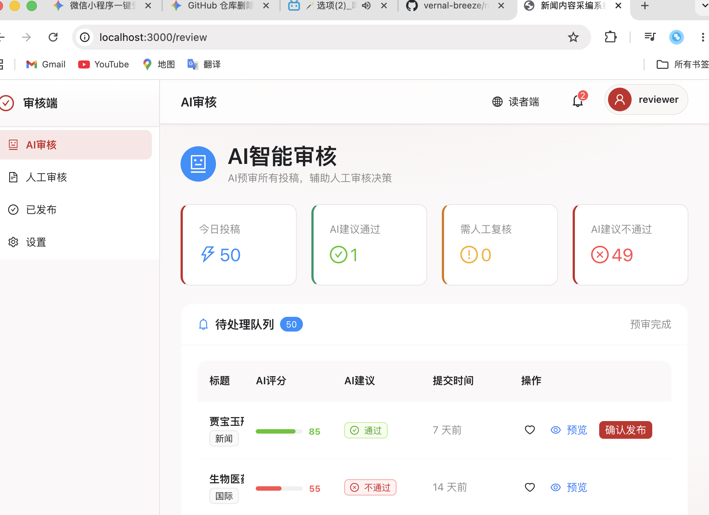
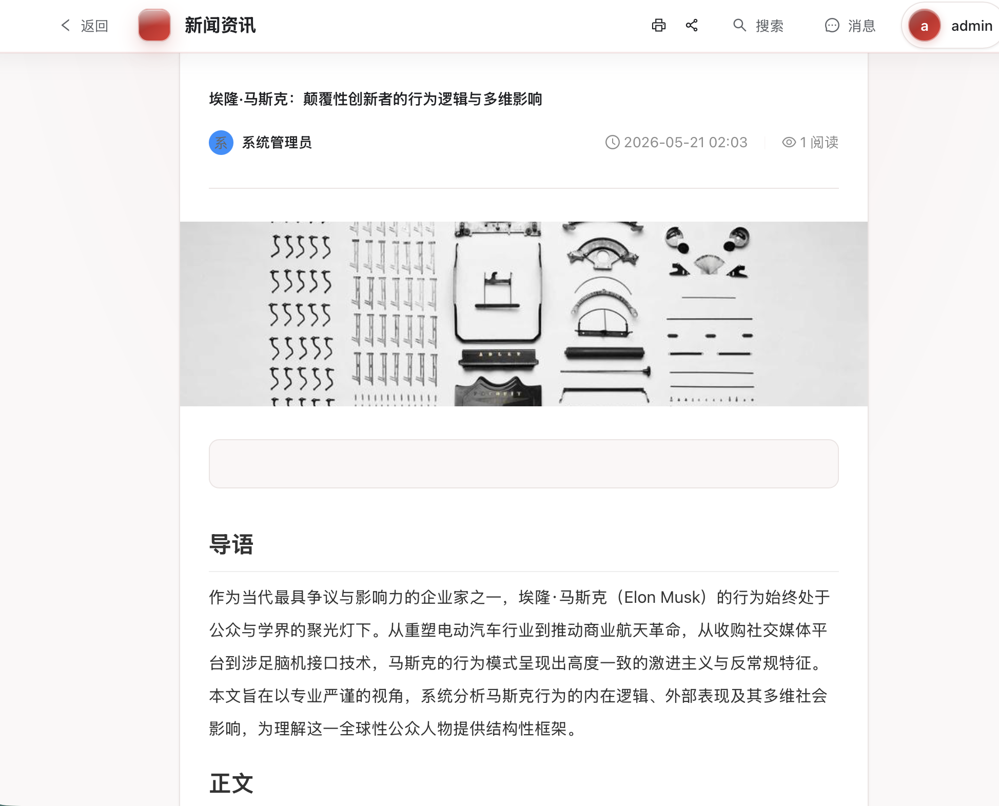
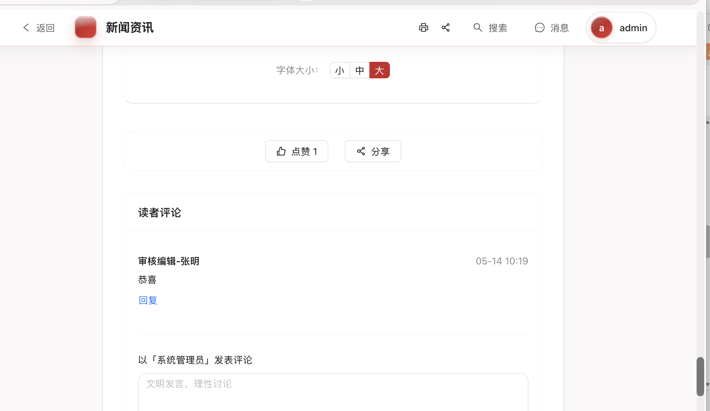
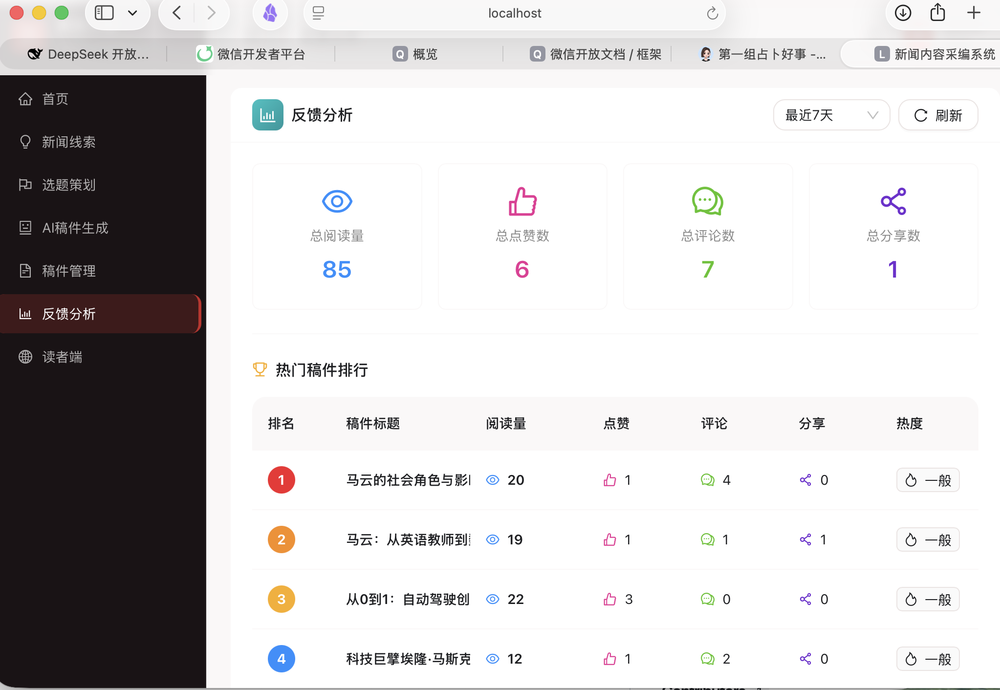

# 基于大模型的新闻内容采编系统

> 项目名称：NewsFinshied  
> 技术栈：FastAPI + React 18 + TypeScript + MySQL 8.0 + SiliconFlow DeepSeek-V3

本项目是一个面向新闻采编场景的全流程智能平台，覆盖“线索采集、选题策划、AI 稿件生成、稿件管理、审核发布、读者反馈”完整链路。系统通过大模型能力辅助新闻生产，提高线索发现、内容生成和审核预审效率。

## 核心功能

### 采编端

- 新闻线索：从可采集到有效内容的新闻源获取线索，支持 AI 分析新闻价值和传播潜力。

- 选题策划：支持选题创建、编辑、状态管理，以及选题与稿件关联。

- AI 稿件生成：支持输入标题、关键词、正文要求和自定义提示词，一起发送给 AI 生成稿件。

- 稿件管理：支持稿件创建、编辑、状态流转、提交审核和发布。

- 数据统计：展示稿件数量、线索数量、发布数量、待审核数量等核心指标。

### 审核端

- 待审队列：集中展示待审核稿件。

- AI 预审：大模型辅助判断内容质量、风险和审核建议。
- 审核流转：支持通过、拒绝、退回修改。
- 发布管理：审核通过后可发布到读者端。

### 读者端

- 文章浏览：展示已发布稿件。


- 搜索筛选：支持按标题、内容和分类检索,字体大小。

- 互动反馈：支持评论、点赞等读者反馈能力。


## 快速启动

项目根目录提供一键启动脚本：

```bash
./start.sh
```

常用命令：

```bash
./start.sh status
./start.sh stop
./start.sh logs backend
./start.sh logs frontend
```

默认访问地址：

- 前端：http://localhost:3000
- 后端：http://localhost:8000
- API 文档：http://localhost:8000/docs

## 默认环境

后端数据库默认使用 MySQL：

```bash
DATABASE_URL=mysql+pymysql://news_editor:apppass123@[::1]:3306/news_editor?charset=utf8mb4
```

AI 配置示例：

```bash
SILICONFLOW_API_KEY=<your-api-key>
AI_MODEL=deepseek-ai/DeepSeek-V3
```

## 项目结构

```text
news_finshied/
├── backend/                 # FastAPI 后端
│   ├── app/
│   │   ├── main.py          # 应用入口和路由注册
│   │   ├── database.py      # 数据库连接
│   │   ├── core/            # 配置、认证、安全能力
│   │   ├── models/          # SQLAlchemy 数据模型
│   │   ├── routers/         # API 路由
│   │   ├── schemas/         # Pydantic 请求响应模型
│   │   └── services/        # 业务服务
│   ├── init.sql             # MySQL 初始化脚本
│   └── requirements.txt     # Python 依赖
├── frontend/                # React + TypeScript 前端
│   ├── src/
│   │   ├── pages/           # 页面
│   │   ├── services/        # API 请求
│   │   └── utils/           # 工具函数
│   └── package.json
├── docker-compose.yml       # Docker 编排
├── start.sh                 # 本地一键启动脚本
├── 架构文档.md
├── 调整清单.md
└── 对象问题创新点.md
```

## 技术栈

| 层级 | 技术 |
|------|------|
| 前端 | React 18 + TypeScript + Vite + Ant Design |
| 后端 | FastAPI + SQLAlchemy 2.0 + Pydantic v2 |
| 数据库 | MySQL 8.0 |
| AI 服务 | SiliconFlow API / DeepSeek-V3 |
| 认证 | JWT |
| 部署 | Docker Compose / 本地脚本 |

## 核心数据表

| 表名 | 说明 |
|------|------|
| `users` | 用户与角色 |
| `clues` | 新闻线索 |
| `topics` | 选题策划 |
| `articles` | 新闻稿件 |
| `reviews` | 审核记录 |
| `feedbacks` | 读者反馈统计 |
| `messages` | 站内消息 |
| `collections` | 采集任务 |
